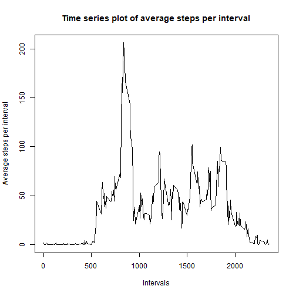
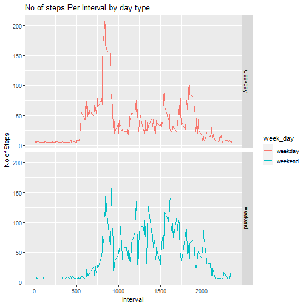

### Overview

This assignment makes use of data from a personal activity monitoring device. This device collects data at 5 minute intervals through out the day. The data consists of two months of data from an anonymous individual collected during the months of October and November, 2012 and include the number of steps taken in 5 minute intervals each day.

### Dataset

Dataset is obtained from [Activity Monitoring Data](https://d396qusza40orc.cloudfront.net/repdata%2Fdata%2Factivity.zip)

### Loading the libraries

```r
library(ggplot2)
library(dplyr)
```

```
## 
## Attaching package: 'dplyr'
```

```
## The following objects are masked from 'package:stats':
## 
##     filter, lag
```

```
## The following objects are masked from 'package:base':
## 
##     intersect, setdiff, setequal, union
```
### 1. Reading the data


```r
unzip("activity.zip")
activity_data_full<-read.csv("activity.csv", stringsAsFactors = FALSE, header=TRUE)
activity_data<-activity_data_full[complete.cases(activity_data_full),]
activity_data$date<-as.Date(activity_data$date)
str(activity_data)
```

```
## 'data.frame':	15264 obs. of  3 variables:
##  $ steps   : int  0 0 0 0 0 0 0 0 0 0 ...
##  $ date    : Date, format: "2012-10-02" "2012-10-02" ...
##  $ interval: int  0 5 10 15 20 25 30 35 40 45 ...
```
The data has 15264 complete (not null) observations and 3 columns (steps, date and interval).

### 2. Histogram of total steps taken each day


```r
##Aggregate total steps per day
act_summ<-aggregate(steps~date,activity_data,sum)

##plot histogram
hist(act_summ$steps,xlab="Total Steps taken per day", ylab="Frequency", main= "Total Steps Taken per Day")
```


### 3. Mean and median number of steps taken each day


```r
# Calculating mean steps per day

mean_steps<-mean(act_summ$steps)

# calculating median steps per day

median_steps<-median(act_summ$steps)

cbind(mean_steps,median_steps)
```

```
##      mean_steps median_steps
## [1,]   10766.19        10765
```

### 4. Time series plot of the average number of steps taken


```r
avg_steps_per_interval<-aggregate(steps~interval,activity_data, mean)

plot(x=avg_steps_per_interval$interval,y=avg_steps_per_interval$steps,type="l",xlab="Intervals",ylab="Average steps per interval",main="Time series plot of average steps per interval")
```



### 5. The 5-minute interval that, on average, contains the maximum number of steps


```r
avg_steps_per_interval[avg_steps_per_interval$steps==max(avg_steps_per_interval$steps),]
```

```
##     interval    steps
## 104      835 206.1698
```
### 6. Code to describe and show a strategy for imputing missing data

```r
#Let's find out total missing data in the data set.

str(activity_data_full[!complete.cases(activity_data_full$steps),])
```

```
## 'data.frame':	2304 obs. of  3 variables:
##  $ steps   : int  NA NA NA NA NA NA NA NA NA NA ...
##  $ date    : chr  "2012-10-01" "2012-10-01" "2012-10-01" "2012-10-01" ...
##  $ interval: int  0 5 10 15 20 25 30 35 40 45 ...
```

There are a total of 2304 observations that are missing in this data set.


```r
#Calculate average steps
avg_steps<-mean(activity_data_full[!is.na(activity_data_full$steps),]$steps)

#copy the data set to new variable
activity_data_imputed<-activity_data_full

#update the new missing data using the calculated average steps
activity_data_imputed[is.na(activity_data_imputed$steps),]$steps<-avg_steps
```
Here is the summary after imputing the missing observations:


```r
str(activity_data_imputed)
```

```
## 'data.frame':	17568 obs. of  3 variables:
##  $ steps   : num  37.4 37.4 37.4 37.4 37.4 ...
##  $ date    : chr  "2012-10-01" "2012-10-01" "2012-10-01" "2012-10-01" ...
##  $ interval: int  0 5 10 15 20 25 30 35 40 45 ...
```
    

### 7. Histogram of the total number of steps taken each day after missing values are imputed


```r
#aggregate total steps per day

avg_steps_imp<-aggregate(steps~date,activity_data_imputed,mean)

#Plot histogram
hist(avg_steps_imp$steps, xlab="average steps per date (Imputed values)",ylab="Frequency", main="Histogram of average steps per day (Using Imputed values)")
```


### 8. Panel plot comparing the average number of steps taken per 5-minute interval across weekdays and weekends


```r
# add a new column for specifying day of week

activity_data_imputed$date<-as.Date(activity_data_imputed$date)
wk_days<-c("Monday","Tuesday","Wednesday","Thursday","Friday")
activity_data_imputed$week_day<-factor((weekdays(activity_data_imputed$date) %in% wk_days),levels=c(TRUE,FALSE),labels=c("weekday","weekend"))


# Calculate avg steps per interval for weekends and weekdays

steps_per_day <- aggregate(steps ~ interval+week_day, activity_data_imputed, mean)

# Create the plot panel
plt <- ggplot(steps_per_day, aes(interval, steps)) +
    geom_line(aes(colour = week_day)) +
    facet_grid(week_day ~ ., scales="fixed", space="fixed") +
    labs(x="Interval", y=expression("No of Steps")) +
    ggtitle("No of steps Per Interval by day type")
print(plt)
```



From the above, we can observe that the user begins workouts later in the day during weekends.


